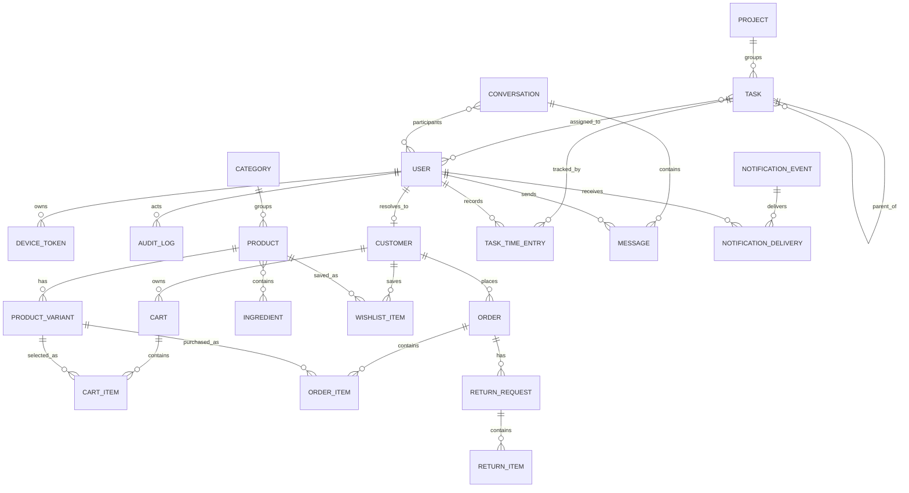

# Data model

The application uses Eloquent models backed by MySQL. The diagram shows primary business relationships; audit and notification metadata fields are omitted for clarity.

## Ownership rules

- Shopify identifiers coexist with local integer identifiers on sales records. Normalize Shopify GIDs through `ShopifyId` helpers before querying.
- Cart items identify product variants, not base products.
- Order items preserve unit price and quantity at purchase time.
- Return requests may originate from local orders, Shopify proxies, or customer-account flows.
- Notification events represent one logical event; deliveries track per-recipient read and dismissal state.
- A task may have a parent task, multiple assignees, and multiple time entries. Only one active entry per applicable user/task flow should be allowed by service behavior.

Apply schema changes through new migrations. Review foreign keys, nullability, indexes, casts, resources, factories, and rollback behavior together.

