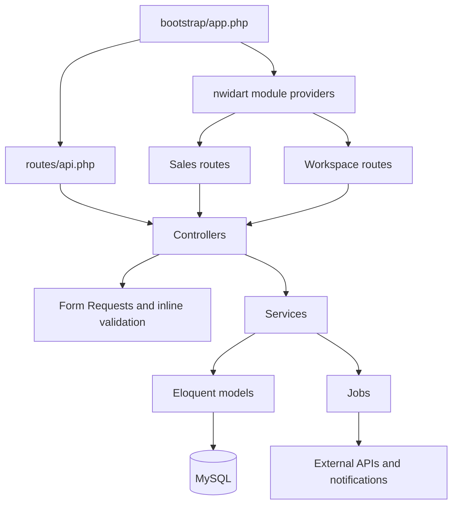

# System overview

The backend is a modular Laravel monolith. Core, Sales, and Workspace share one Laravel container, one relational database connection, authentication, logging, queues, and deployment lifecycle. Module boundaries organize ownership; they are not separate network services.

## Architectural conventions

- Controllers validate input, enforce request-level ownership, invoke services, and return resources or JSON responses.
- Services own multi-step business operations and transaction boundaries.
- Eloquent models own persistence relationships, casts, query scopes, and limited identity helpers.
- Transformers and API Resources define serialized response shapes.
- Jobs isolate retryable or slow external work.
- Events publish realtime state changes through Reverb-compatible channels.
- Policies and middleware enforce role, ownership, participant, and Shopify-signature rules.

## Module dependencies

Sales and Workspace both depend on the core `User` and `AuditLog` concepts. Workspace reuses Sales return models for staff return views. This is a deliberate coupling inside the monolith and must be considered before extracting modules into services.

