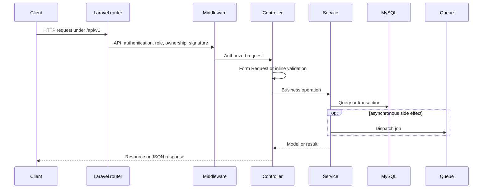

# Request lifecycle

`bootstrap/app.php` registers core routes and JSON exception rendering. Sales and Workspace route providers register their module routes with the same version prefix. API requests are stateless and normally use Sanctum bearer tokens.

Validation failures return HTTP 422. Missing models generally become HTTP 404. Authentication and authorization failures become HTTP 401 or 403. Business-state conflicts may use HTTP 409 or 422 according to the controller or service.

When adding an endpoint, add the route, validation, authorization, service behavior, response resource, feature test, and OpenAPI documentation in the same change.

