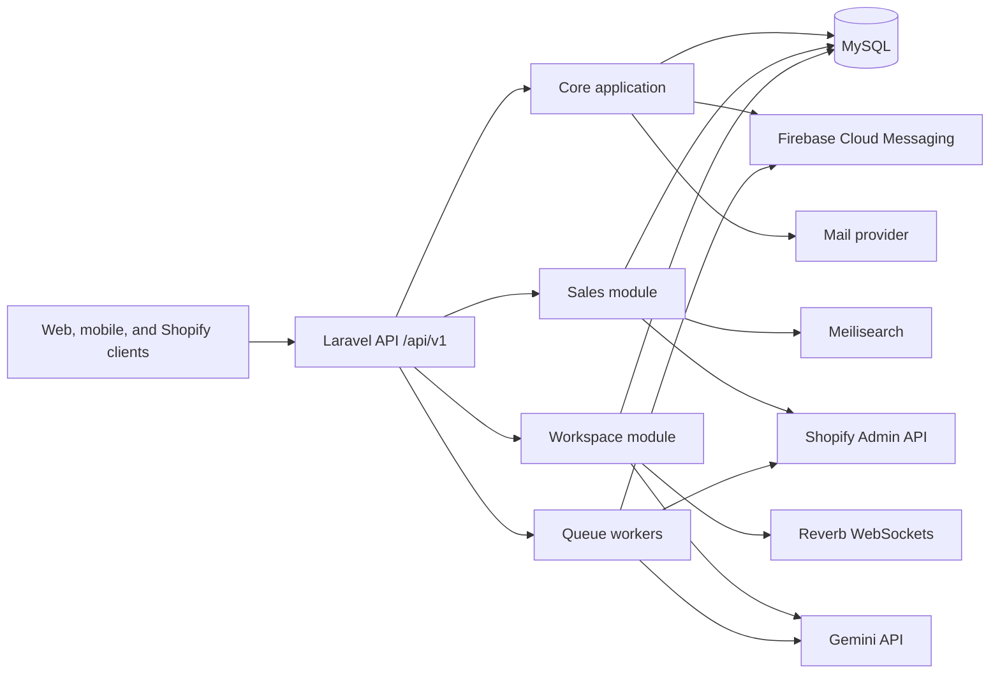

# Lumi backend maintenance documentation

This site is the maintenance reference for the Lumi backend. It describes the deployed behavior of the Laravel application, its modular boundaries, HTTP contract, data ownership, background processing, and external integrations.

## System at a glance

| Area | Responsibility |
|---|---|
| Core application | Authentication, users, roles, presence, device tokens, audit logging, mail, and push notifications |
| Sales module | Catalog, search, carts, wishlists, checkout, orders, returns, and Shopify synchronization |
| Workspace module | Projects, tasks, assignments, time tracking, conversations, notifications, and optional AI replies |
| Runtime services | MySQL, queue workers, Reverb, Meilisearch, Firebase, Resend/mail, Shopify, and Gemini |

## Maintenance priorities

1. Treat the [interactive API reference](api/reference.md) and automated route-coverage check as the HTTP contract.
2. Run queue workers and the scheduler alongside the HTTP process.
3. Verify Shopify signatures before changing proxy or webhook handling.
4. Preserve database migrations; add new migrations instead of editing migrations already deployed.
5. Update this site in the same change as any route, workflow, integration, or configuration change.

Begin with [local setup](getting-started/local-setup.md), then read the [architecture overview](architecture/overview.md).

