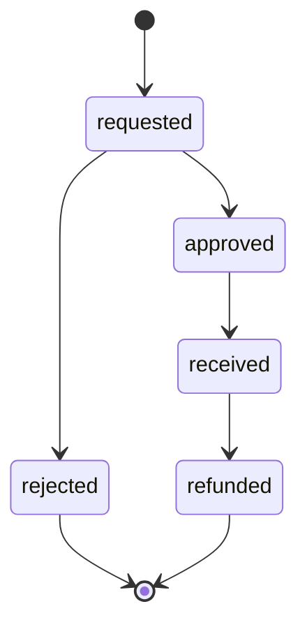

# Sales module

## Catalog and search

Public catalog endpoints expose products, variants, categories, and ingredients through transformers. `ProductSearchController` delegates product text search to Laravel Scout and Meilisearch. Product and variant writes require staff authorization; deletion requires an administrator through `ProductPolicy`.

## Cart and wishlist

`CartService` creates or retrieves a customer's cart, adds variants, changes quantities, and removes items. It validates variant existence and stock constraints before mutation. `WishlistService` adds and removes product selections with customer ownership enforced at the route boundary.

Both functions have authenticated customer endpoints and Shopify app-proxy adapters. Proxy adapters resolve Shopify customer identifiers and require valid signatures.

## Checkout and orders

`CheckoutService` validates the cart and stock, creates the order and items transactionally, adjusts inventory, and clears purchased cart state. Order transformers map stored financial and fulfillment fields to the API representation. Customer order access is ownership-restricted; staff can list and inspect all orders.

## Returns

`ReturnService` creates local or Shopify-linked returns and controls transitions through approval, rejection, receipt, and refund. Administrative actions are auditable. Invalid state transitions must remain rejected rather than silently changing status.

## Shopify synchronization

The integration uses GraphQL through `ShopifyConnector`, cached access-token acquisition, normalization helpers, queued product and inventory synchronization, collection reconciliation, signed app proxies, and verified webhooks. See [Shopify integration](../integrations/shopify.md).

